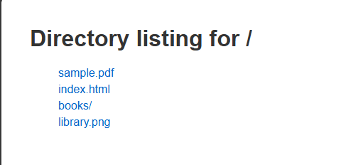
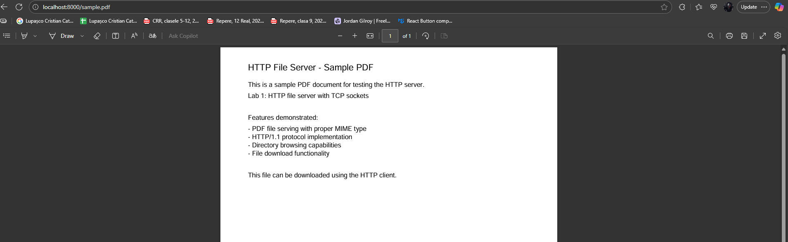
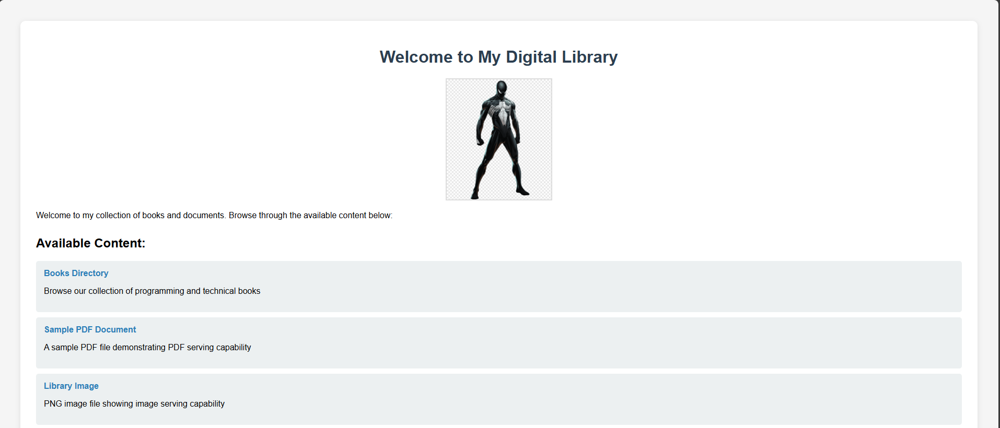
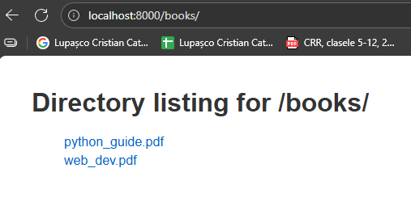

# Lab 1: HTTP File Server with TCP Sockets

## Overview

A simple HTTP file server implementation using raw TCP sockets in Python. The server serves files from a directory and includes a client for downloading content. The entire application is containerized using Docker.

## Features

- HTTP/1.1 protocol implementation
- Serves HTML, PDF, PNG files with proper MIME types
- Directory listing with hyperlinks
- HTTP client for file downloads
- Docker containerization

## Project Structure

```
Lab1/
├── lab1.py              # HTTP server
├── client.py            # HTTP client
├── Dockerfile           # Container configuration
├── docker-compose.yml   # Container orchestration
├── content/             # Served files
│   ├── index.html       # Main page with image reference
│   ├── library.png      # Sample image
│   ├── sample.pdf       # Sample document
│   └── books/           # Subdirectory with PDFs
└── downloads/           # Client download directory
```

## Requirements Satisfied

### 1. Directory Listing

The server displays directory contents as HTML pages with clickable links. Screenshot 1 shows the main directory listing at `http://localhost:8000/`.



### 2. PDF File Serving

PDF files are served with proper `application/pdf` MIME type. Screenshot 2 demonstrates successful PDF rendering in the browser.



### 3. HTML Page with Image Reference

The main page (`index.html`) includes an embedded PNG image using the `` tag. Screenshot 3 shows the digital library homepage.



### 4. PNG Image Serving

Images are served with correct `image/png` MIME type and display properly in browsers. Screenshot 4 shows the library image.


### 5. Nested Directory Support

The server handles subdirectories correctly. Screenshot 5 demonstrates the `/books/` directory listing functionality.



## Usage

### Running with Docker

```bash
docker-compose up -d
```

### Running Locally

```bash
python lab1.py content
```

### Using the Client

```bash
# Download HTML (prints to console)
python client.py localhost 8000 /

# Download files (saves to ./downloads/)
python client.py localhost 8000 /sample.pdf
python client.py localhost 8000 /library.png
```

## Implementation Details

### Server Features

- Handles one HTTP request at a time
- Binds to `0.0.0.0:8000` for container compatibility
- Serves files from command-line specified directory
- Returns 404 for missing files, 403 for security violations

### Client Features

- Downloads files using raw TCP sockets
- HTML responses are printed to console
- Binary files (PDF, PNG) are saved to disk
- Creates download directory automatically

### Docker Configuration

- Uses `python:3.11-slim` base image
- Runs as non-root user for security
- Exposes port 8000
- Includes all content and dependencies

## File Types Handled

- **HTML**: Directory listings and web pages (displayed in browser)
- **PDF**: Documents with proper MIME type (opens in PDF viewer)
- **PNG**: Images with correct headers (displays inline)

The implementation successfully demonstrates HTTP protocol fundamentals, file serving capabilities, and containerization best practices.
