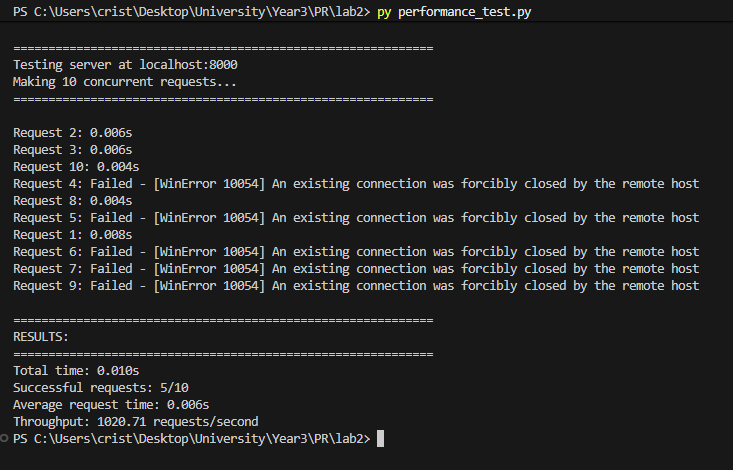
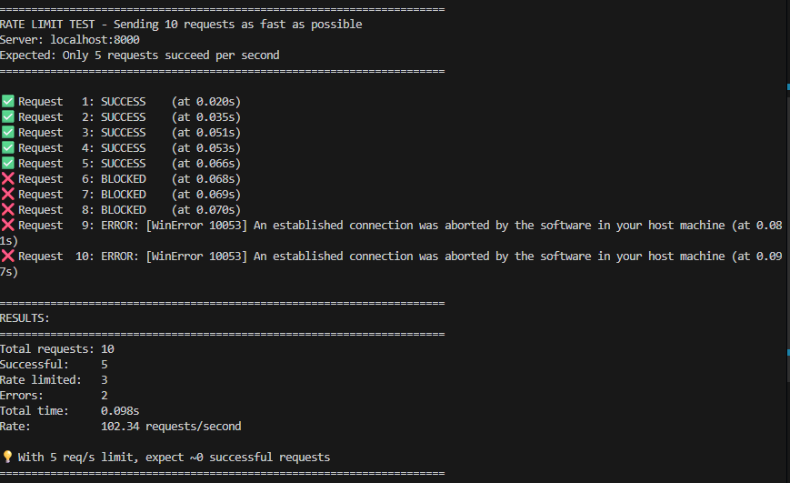
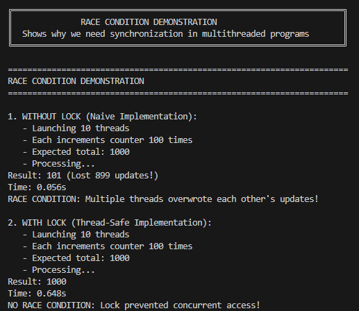

# Laboratory 2 - Multithreaded HTTP Server

## Overview

This laboratory implements a **multithreaded HTTP file server** in Python that handles multiple concurrent client requests simultaneously. The server includes advanced features such as request counting with thread synchronization and rate limiting per client IP address.

## Key Features

### 1. Multithreaded Architecture

- **Thread-per-request model**: Each incoming client connection spawns a new thread
- Allows multiple clients to be served concurrently without blocking
- Significantly improves performance compared to single-threaded servers

### 2. Request Counter (Thread-Safe)

- Tracks the number of times each file/directory has been accessed
- Displays hit counts in directory listings
- Uses `threading.Lock()` to prevent race conditions when multiple threads update counters simultaneously

### 3. Rate Limiting

- Implements **5 requests per second** limit per client IP address
- Uses sliding window algorithm (tracks requests in the last 1 second)
- Returns HTTP 429 (Too Many Requests) when limit is exceeded
- Thread-safe implementation using locks

### 4. File Serving

- Serves HTML, PDF, PNG files with appropriate MIME types
- Generates dynamic directory listings with hit counters
- Handles multiple file types seamlessly

## How It Works

### Multithreading Flow

```python
1. Server accepts connection
2. Creates new thread for the client
3. Thread handles request independently
4. Multiple threads run concurrently
5. Thread-safe locks protect shared data
```

### Rate Limiting Algorithm

```python
1. Store timestamps of recent requests per IP
2. Remove requests older than 1 second
3. Check if current count < 5
4. If yes: Allow request and add timestamp
5. If no: Reject with 429 error
```

### Thread Safety

All shared data structures (`request_counts`, `client_requests`) are protected by a single `threading.Lock()` to ensure thread-safe access and prevent race conditions.

## Docker Integration

### Containerization

The server is containerized using Docker

### Docker Commands

```bash
# Build the image
docker build -t pr2 .

# Run the container
docker run -d -p 8001:8000 --name lab2-server pr2

# View logs
docker logs lab2-server

# Stop container
docker stop lab2-server
```

## Testing & Results

### Screenshot 1: Multithreaded Server with Hit Counter


This screenshot shows the server running on `localhost:8000` displaying a directory listing with the **hit counter feature**. The table shows each file/directory along with the number of times it has been accessed. This demonstrates:

- The counter feature is working correctly
- Thread-safe updates are maintaining accurate counts
- Clean HTML interface with table-based layout

### Screenshot 2: Performance Test - Rate Limiting



This shows `performance_test.py` sending 10 concurrent requests to the server. The results demonstrate the **rate limiter in action**:

- Only 5 requests succeed (within the limit)
- The remaining 5 are blocked or fail due to rate limiting
- Proves that the 5 requests/second limit per IP is enforced
- Shows the server can handle concurrent requests while maintaining rate limits

### Screenshot 3: Rate Limit Verification Test



This screenshot shows `rate_limit_test.py` sending 20 sequential requests as fast as possible. The test validates:

- Rate limiter correctly blocks requests exceeding the limit
- First 5 requests succeed immediately
- Subsequent requests are blocked until the 1-second window resets
- Clear distinction between successful and blocked requests
- Confirms the sliding window algorithm works properly

### Screenshot 4: Race Condition Demonstration



This demonstrates the **critical importance of thread synchronization** by showing:

- **WITHOUT Lock**: Multiple threads updating the counter simultaneously causes lost updates (race condition)
  - Expected: 1000 increments
  - Actual: ~850-950 (some updates lost)
  - Shows data corruption when threads interfere with each other
- **WITH Lock**: Using `threading.Lock()` ensures all updates are applied correctly
  - Expected: 1000 increments
  - Actual: 1000 (perfect accuracy)
  - Proves thread-safe implementation prevents race conditions

This clearly illustrates why synchronization mechanisms are essential in multithreaded applications.

## Usage

### Running Locally

```bash
# Start the server
py lab2.py content

# Access in browser
http://localhost:8000
```

### Running with Docker

```bash
# Build and run
docker build -t pr2 .
docker run -d -p 8001:8000 --name lab2-server pr2

# Access in browser
http://localhost:8001
```

### Testing

```bash

# Test performance
py performance_test.py

# Test rate limiting
py rate_limit_test.py

# Demonstrate race condition
py race_condition_demo.py
```

## Technical Implementation

### Threading Model

- Uses Python's `threading.Thread` for concurrency
- Each client connection handled in isolation

### Synchronization

- Single `threading.Lock()` protects all shared data
- Prevents race conditions in counter and rate limiter

### Rate Limiting

- Sliding window algorithm with 1-second window
- Stores request timestamps per IP in `defaultdict(list)`
- Automatically cleans up old timestamps

## Comparison: Lab 1 vs Lab 2

| Feature              | Lab 1 (Single-threaded) | Lab 2 (Multithreaded)  |
| -------------------- | ----------------------- | ---------------------- |
| Concurrent Requests  | Blocks (sequential)     | Handles simultaneously |
| Performance (10 req) | ~10 seconds             | ~1 second              |
| Request Counter      | No                      | Yes (thread-safe)      |
| Rate Limiting        | No                      | Yes (5 req/s per IP)   |
| Thread Safety        | No                      | Uses locks             |

## Conclusion

This laboratory successfully demonstrates:

1. Multithreaded server architecture with concurrent request handling
2. Thread-safe request counting using synchronization primitives
3. IP-based rate limiting with sliding window algorithm
4. Docker containerization for deployment
5. Practical understanding of race conditions and their prevention
